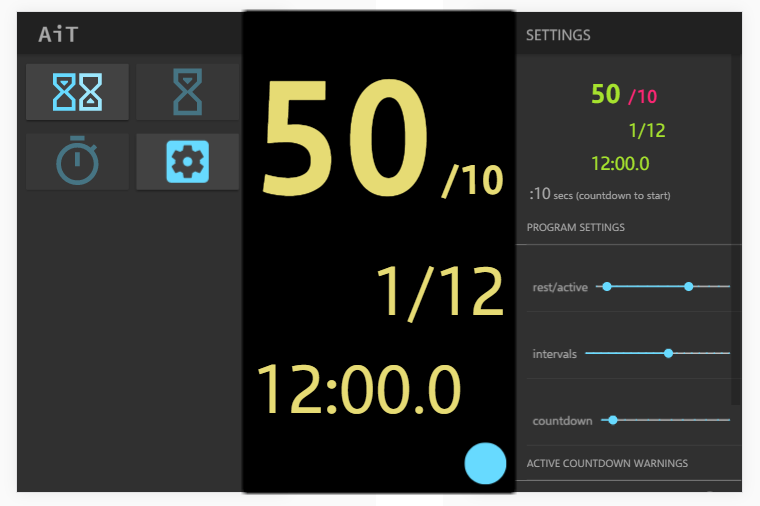

Another interval timer (AiT) that targets mobile devices for your timing needs.  This application has been intended for interval workouts, where there are active and inactive segments.

Features in this application are:
* Adjustable countdown timer before starting interval timer.
* Enable/disable 5, 10 and 15 second warnings to indicate active segment is approaching it's end.
* Changeable themes; 'light' or 'dark' base themes along with 'monokai' and 'RGB and sometimes Y' accent themes.

Planned features:
* Countdown timer.
* Stopwatch that laps on a tap.
* Revamp timer with sequences.  For instance, 10 sec countdown, followed by 12 minute interval session, followed by 10 minute timer.
* Fullscreen mode when timer is running.

## About
This is an Ionic 3.8 project that is intended to target Android and iOS devices.  Ionic leverages Angular, Cordova, RxJS, Sass, TypeScript and Webpack, to name a few.  This was my first project using Ionic.

I plan to have this available on Google Play and Apple iTunes in the next few weeks (e.t.a. 11/30/2017)

## Feedback
Let me know if this is helpful!  Use the Issues section for questions, bugs or requests.
